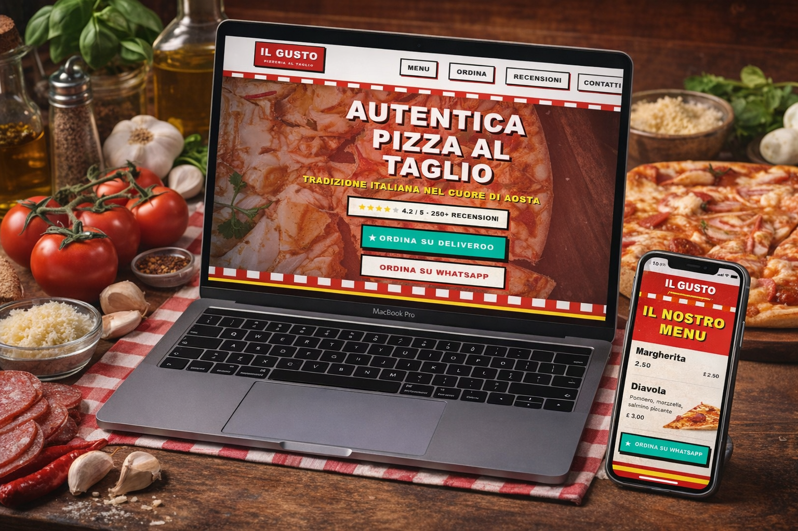
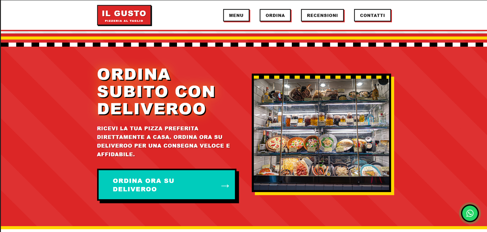

# IL GUSTO — Pizzeria al Taglio Website

Sito web moderno, responsive e ad alte prestazioni per una pizzeria al taglio, progettato per massimizzare conversione, chiarezza visiva e identità del brand.

Questo progetto rappresenta una build statica ottimizzata, pensata per utilizzo reale in produzione o come base per clienti nel settore food & beverage.

---

## Live Demo

https://michelbranche.github.io/ilgusto-demo-diner/

---

## Preview

---

## Obiettivi del progetto

- Creare un sito altamente performante e leggero
- Trasmettere identità visiva forte e coerente
- Ottimizzare l'esperienza mobile-first
- Massimizzare conversione verso Deliveroo e WhatsApp
- Garantire pieno controllo senza dipendenze esterne

---

## Caratteristiche principali

- Design diner-style moderno e distintivo
- Layout completamente responsive
- Navigazione fluida con smooth scrolling
- Integrazione diretta con Deliveroo e WhatsApp
- Performance elevate (zero framework, zero bundle pesanti)
- Compatibile con tutti i browser moderni
- Struttura semplice e facilmente personalizzabile

---

## Stack Tecnologico

- HTML5
- CSS3 (Custom, no framework)
- Vanilla JavaScript
- Font Awesome (per icone)
- Hosting compatibile con GitHub Pages, Netlify, qualsiasi server statico

---

---

## Performance

Questo sito è ottimizzato per:

- caricamento rapido
- rendering immediato
- nessun blocco JavaScript
- nessuna dipendenza pesante

Ideale per dispositivi mobile e connessioni lente.

---

## Utilizzo

Puoi usare questo progetto per:

- sito reale di una pizzeria o ristorante
- base per progetti clienti
- portfolio personale
- demo commerciale

---

## Personalizzazione

Puoi facilmente modificare:

- testi in `index.html`
- colori in `style.css`
- immagini nella cartella `/images`
- link Deliveroo e WhatsApp

---

## Licenza

MIT License

Copyright (c) 2026 Michel Branche

Permission is hereby granted, free of charge, to any person obtaining a copy
of this software and associated documentation files (the "Software"), to deal
in the Software without restriction, including without limitation the rights
to use, copy, modify, merge, publish, distribute, sublicense, and/or sell
copies of the Software.

The above copyright notice and this permission notice shall be included in all copies or substantial portions of the Software.

THE SOFTWARE IS PROVIDED "AS IS", WITHOUT WARRANTY OF ANY KIND.

---

## Crediti

Design, sviluppo e ottimizzazione:

Michel Branche  
Web Developer — Front/back-end

GitHub:  
https://github.com/MichelBranche

Portfolio:  
https://michelbranche.github.io/portfolio/

Contatto:  
michel.lavoro@gmail.com

---

## Note

Questo progetto è stato progettato con focus su:

- performance reale
- conversione utente
- identità visiva forte
- riutilizzabilità commerciale

---

## Stato del progetto

Produzione-ready
